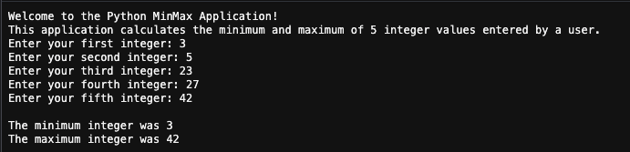
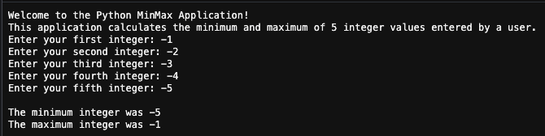
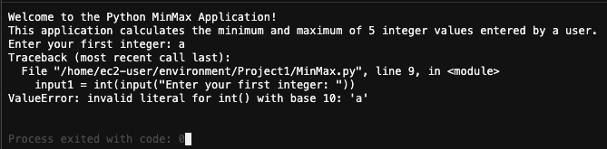
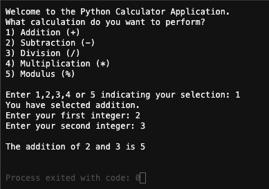
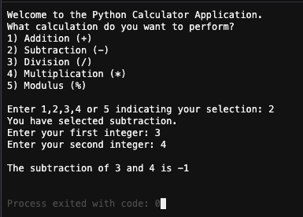
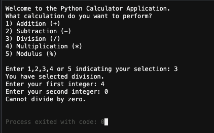
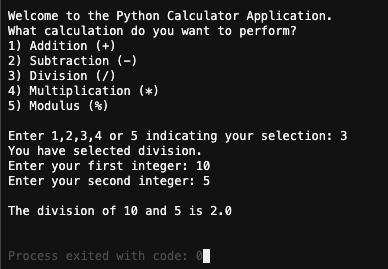
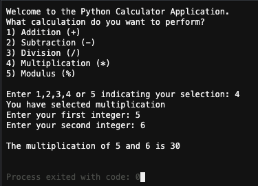
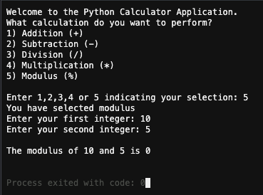

# SDEV 300 - Project 1

**Author:** Tyler D Clark  
**Date:** 19 March 2020  
This post will serve as documentation for the project 1
___
 

## MinMax Application

|Test Case |Input|Expected Output|Actual Output|Pass?|
|---|---|---|---|---|
|1a|3, 5, 23, 27, 42|Min: 3, Max: 42|Min: 3, Max: 42|Yes|
|1b|-1, -2, -3, -4, -5|Min: -5, Max: -1|Min: -5, Max: -1|Yes|
|1c|a, b, c, d, e|error|error|Yes, error-catching out of assignment scope|

 

### Test Case 1a

Output in Cloud9 IDE of test case 1a (normal numbers)

### Test Case 1b

Output in Cloud9 IDE of test case 1b (negative numbers)

### Test Case 1c

Output in Cloud9 IDE of test case 1c (error with characters)

___
 

## Calculator Application

|Test Case |Input|Expected Output|Actual Output|Pass?|
|---|---|---|---|---|
|2a|1, 2, 3|2 + 3 = 5|2 + 3 + 5|Yes|
|2b|2, 3, 4|3 - 4 = -1|3 - 4 = -1|Yes|
|2c|3, 4, 0|warning message and exit|warning message and exit|Yes|
|2d|3, 10, 5|10 / 5 = 2|10 / 5 = 2|yes|
|2e|4, 5, 6|5 * 6 = 30|5 * 6 = 30|yes|
|2f|5, 10, 5|10 % 5 = 0|10 % 5 = 0|yes|

### Test Case 2a

  
Output in Cloud9 IDE of test case 2a (addition)

### Test Case 2b

  
Output in Cloud9 IDE of test case 2b (subtraction)

### Test Case 2c

  
Output in Cloud9 IDE of test case 2c (division by zero)

### Test Case 2d

  
Output in Cloud9 IDE of test case 2d (normal division)

### Test Case 2e

  
Output in Cloud9 IDE of test case 2e (multiplication)

### Test Case 2f

  
Output in Cloud9 IDE of test case 2f (modulus)
