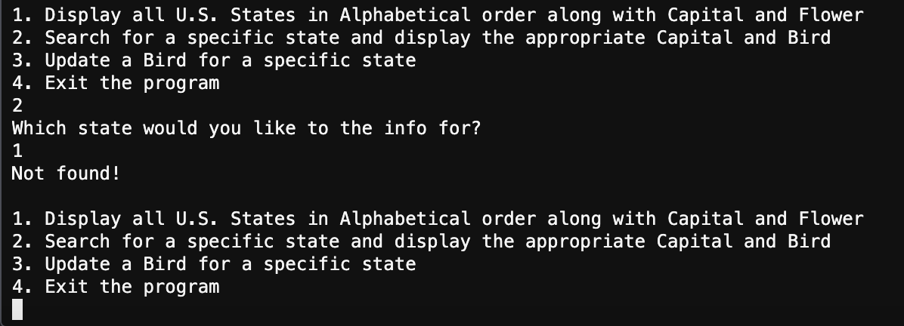

# SDEV 300 - Project 1

**Author:** Tyler D Clark  
**Date:** 5 April 2020  
This post will serve as documentation for the project 3. Includes test cases and screenshots for the state bird/flower project and the squared/cubed set program.
___
 

## State Bird Flower program

|Test Case |Input|Expected Output|Actual Output|Pass?|
|---|---|---|---|---|
|1a|1|List of states info|List of states info (please see screenshot below)|Yes|
|1b|2, Virginia|Virginia's state info|Virginia: Capital: Richmond, Bird: Cardinal, Flower: Dogwood|Yes|
|1c|2, hawaii|Hawaii's state info|Hawaii: Capital: Honolulu, Bird: Nene, Flower: Hibiscus|Yes
|1d|2, 1|error|Not found!|Yes
|1e|3, ohio, a birb|Confirmation of bird updated|*** New Bird updated *** Ohio: Capital: Columbus, Bird: a birb, Flower: Scarlet Carnation|Yes
|1f|1|List states with updated Ohio bird|List of states info (please see screenshot below)|Yes|
|1g|4|Exit program|*** Thank you for using the State Bird and Flower Program! ***|Yes|
|1h|a|error|please use Integer for menu selection. Not a valid response!|Yes

 

### Test Case 1a

Output in Cloud9 IDE of test case 1a (showing list of state info)

### Test Case 1b

Output in Cloud9 IDE of test case 1b (Showing state with sentence case input)

### Test Case 1c

Output in Cloud9 IDE of test case 1c (Showing state with lower case input)

### Test Case 1d

Output in Cloud9 IDE of test case 1d (error with input)

### Test Case 1e

Output in Cloud9 IDE of test case 1e (updating bird)

### Test Case 1f

Output in Cloud9 IDE of test case 1f (showing updated bird by listing all birds)

Output in Cloud9 IDE of test case 1g (showing exit message)

Output in Cloud9 IDE of test case 1g (showing error catching)
___
 

## Square and Cube from 1 to 100 Program

|Test Case |Input|Expected Output|Actual Output|Pass?|
|---|---|---|---|---|
|2a|1|the Square and Cube for Integers ranging from 1 to 100|the Square and Cube for Integers ranging from 1 to 100|Yes|
|2b|2, 10|Square and cube values for 10|Integer:10, Square value: 100, Cube value: 1000|Yes|
|2c|2, 101|Not in set|Integer not in sets|Yes|
|2d|3|Union of sets|Union of the sets x^2 and x^3 over [1,100](followed by union)|Yes|
|2e|4|Intersection of the sets|Intersection of the sets x^2 and x^3 over [1,100](followed the intersection)|Yes|
|2f|5|Differences of the sets|The two differences of the sets|Yes|
|2g|c|error|Please use integers! Invalid Selection|Yes|
|2h|6|Exit program|Thank you for using the Square and Cube from 1 to 100 Program!|Yes

### Test Case 2a

  
Output in Cloud9 IDE of test case 2a (Displaying the square and cube for 1 - 100, the screenshot shows just the beginning of the list)

### Test Case 2b

  
Output in Cloud9 IDE of test case 2b (Searching for valid integer in sets)

### Test Case 2c

  
Output in Cloud9 IDE of test case 2c (Searching for integer not in sets)

### Test Case 2d

  
Output in Cloud9 IDE of test case 2d (Union of sets, this screenshot shows the beginning of the list)

### Test Case 2e

  
Output in Cloud9 IDE of test case 2e (Intersection of the sets)

### Test Case 2f

  
Output in Cloud9 IDE of test case 2f (difference of square set and cube set)

  
Output in Cloud9 IDE of test case 2f (difference of cube set and square set)

### Test Case 2g

  
Output in Cloud9 IDE of test case 2g (showing response for invalid selection)

### Test Case 2h

  
Output in Cloud9 IDE of test case 2g (showing exit message)