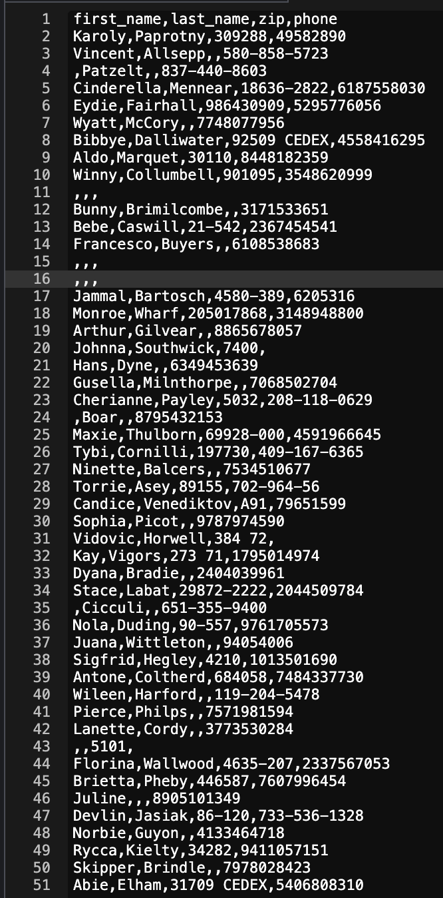

# SDEV 300 - Project 4

**Author:** Tyler D Clark  
**Date:** 11 April 2020  
This post will serve as documentation for the project 4. Includes test cases and screenshots for the python matrix math and the python data-munging program.
___
 

## Python Matrix Math program

|Test Case |Input|Expected Output|Actual Output|Pass?|
|---|---|---|---|---|
|1a|n|Exit prompt|(please see screenshot below)|Yes|
|1b|y, 1 1 1 1 1 1 1 1 1, 1 1 1 1 1 1 1 1 1, a|addition of the two matrices|(please see screenshot below)|Yes|
|1c|y, 2 2 2 2 2 2 2 2 2, 1 1 1 1 1 1 1 1 1, b|subtraction of the two matrices|(please see screenshot below)|Yes
|1d|y, 1 2 3 4 5 6 7 8 9, 9 8 7 6 5 4 3 2 1|matrix multiplication of the two matrices|(please see screenshot below)|Yes
|1e|y, 3 6 3 6 3 6 3 6 3, 6 3 6 3 6 3 6 3 6|element by element multiplication of the two matrices|(please see screenshot below)|Yes
|1f|1|error| request for proper response (please see screenshot below)|Yes|
|1g|y, 1 2 3 4 5 6 7 8, 1 2 3 4 5 6 7 8 9 10|error|request for proper response (please see screenshot below)|Yes|

 

### Test Case 1a

Output in Cloud9 IDE of test case 1a (exit message)

### Test Case 1b

Output in Cloud9 IDE of test case 1b (showing matrix addition)

### Test Case 1c

Output in Cloud9 IDE of test case 1c (showing matrix subtraction)

### Test Case 1d

Output in Cloud9 IDE of test case 1d (showing matrix multiplication)

### Test Case 1e

Output in Cloud9 IDE of test case 1e (showing element by element multiplication)

### Test Case 1f

Output in Cloud9 IDE of test case 1f (showing incorrect input handling)

### Test Case 1g

Output in Cloud9 IDE of test case 1g (showing incorrect input handling)
___
 

## Python Data Munging Application

The second program did not take key inputs, but instead was passed a csv file of corrupt data (also attached). The program then munged and formatted the data properly.

### Data before running through the program

  

### Output of the python data-munging program

  
