# SDEV 300 - Project 5

**Author:** Tyler D Clark  
**Date:** 15 April 2020  
This post will serve as documentation for the project 5. Includes test cases and screenshots for the python data analysis app.
___

## Python Data Analysis program

|Test Case |Input|Expected Output|Actual Output|Pass?|
|---|---|---|---|---|
|1| 1, a|Information and graph output for Apr 1 Pop|Please see below for screenshot and graph|Yes|
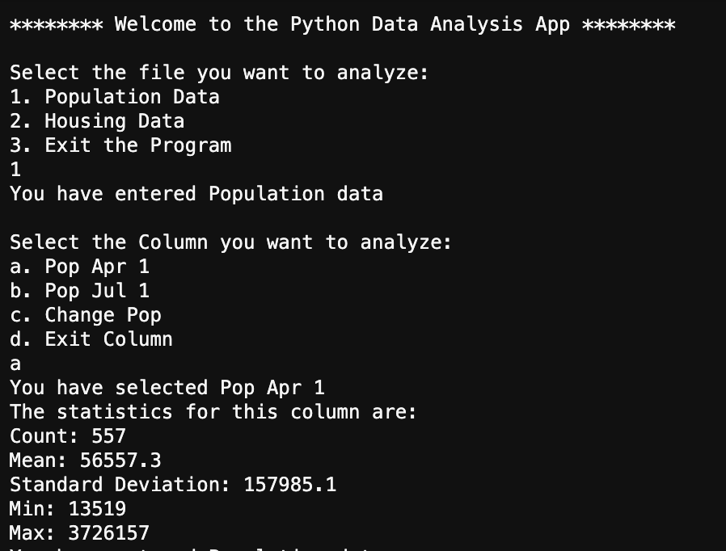

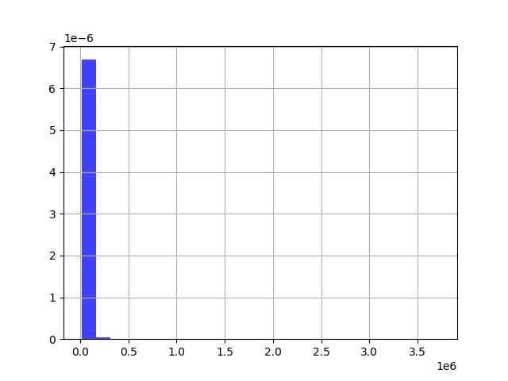

|Test Case |Input|Expected Output|Actual Output|Pass?|
|---|---|---|---|---|
|2| 1, b|Information and graph output for Jul 1 pop|Please see below for screenshot and graph|Yes|

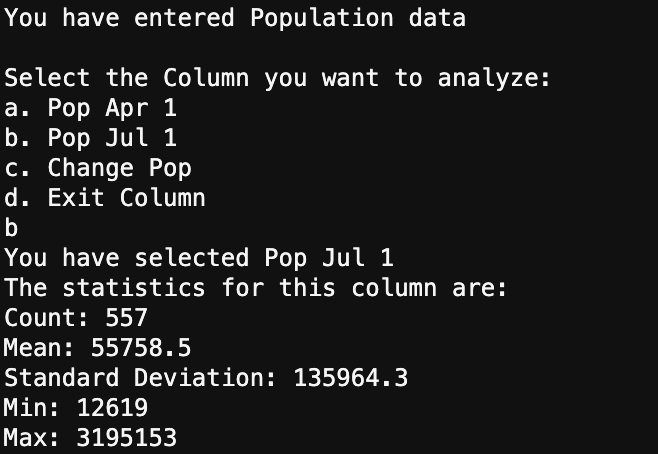

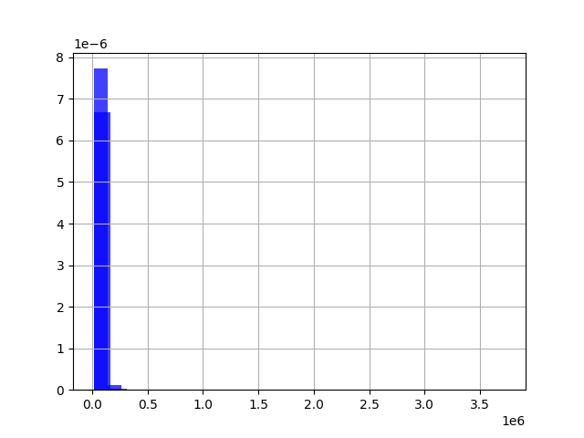

|Test Case |Input|Expected Output|Actual Output|Pass?|
|---|---|---|---|---|
|3| 1, c|Information and graph output for pop change|Please see below for screenshot and graph|Yes|

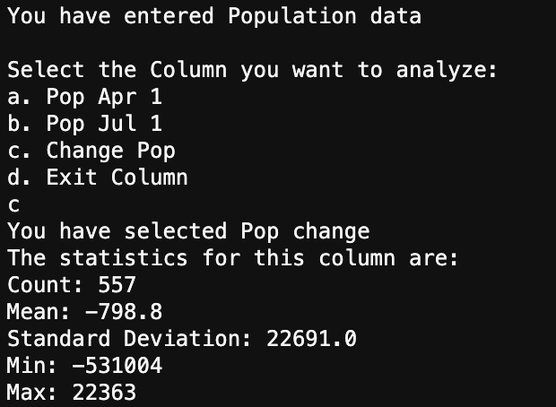

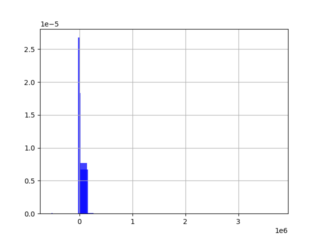

|Test Case |Input|Expected Output|Actual Output|Pass?|
|---|---|---|---|---|
|4| 1, d|Exiting the current column|Please see below for screenshot|Yes|

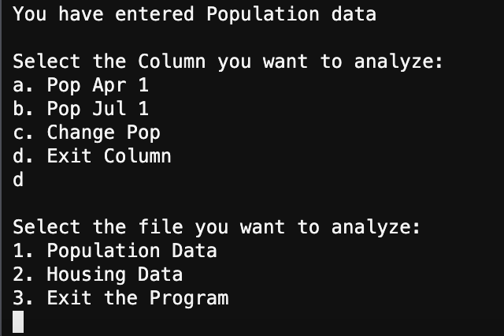

|Test Case |Input|Expected Output|Actual Output|Pass?|
|---|---|---|---|---|
|5| 2, a|Information and graph output for housing age|Please see below for screenshot and graph|Yes|

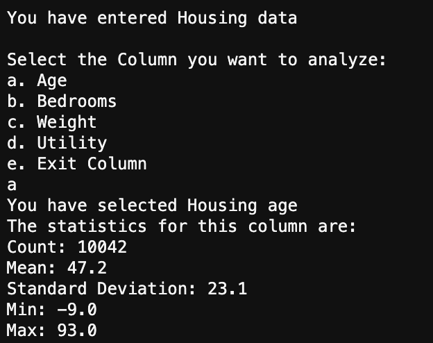

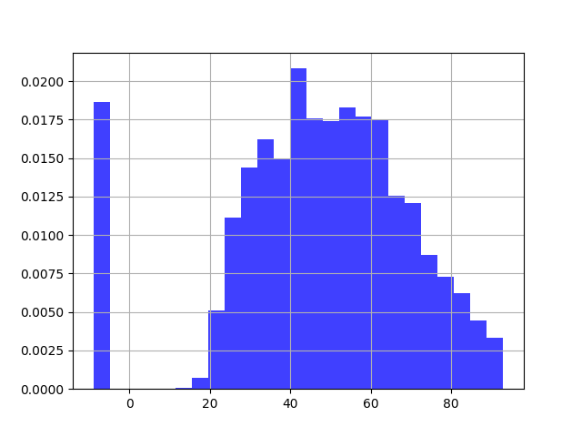

|Test Case |Input|Expected Output|Actual Output|Pass?|
|---|---|---|---|---|
|6| 2, b|Information and graph output for housing bedrooms|Please see below for screenshot and graph|Yes|

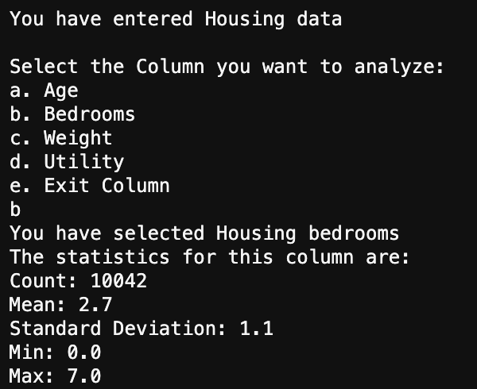

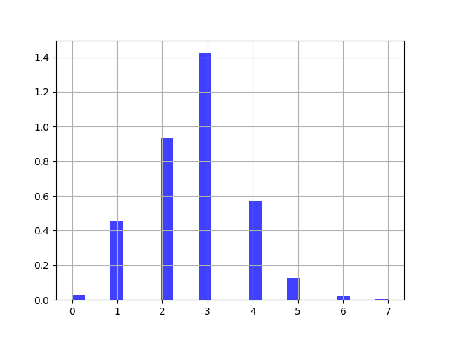

|Test Case |Input|Expected Output|Actual Output|Pass?|
|---|---|---|---|---|
|7| 2, c|Information and graph output for housing weight|Please see below for screenshot and graph|Yes|

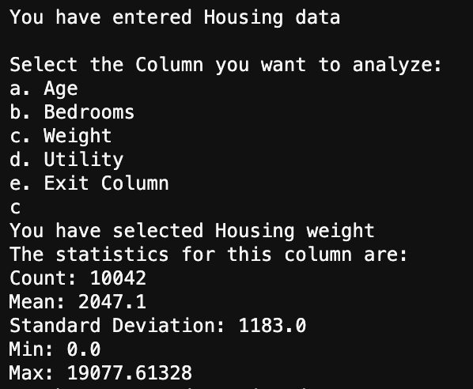

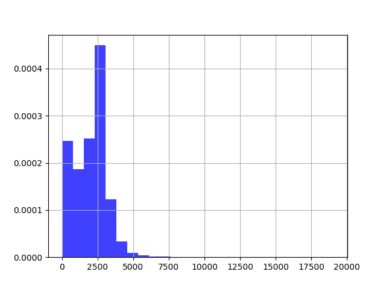

|Test Case |Input|Expected Output|Actual Output|Pass?|
|---|---|---|---|---|
|8| 2, d|Information and graph output for housing utility|Please see below for screenshot and graph|Yes|

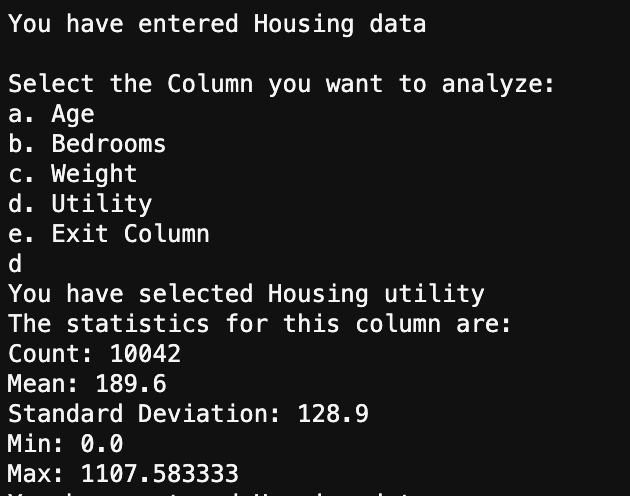

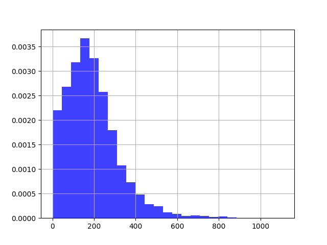

|Test Case |Input|Expected Output|Actual Output|Pass?|
|---|---|---|---|---|
|9| 2, e|Exiting the current column|Please see below for screenshot|Yes|

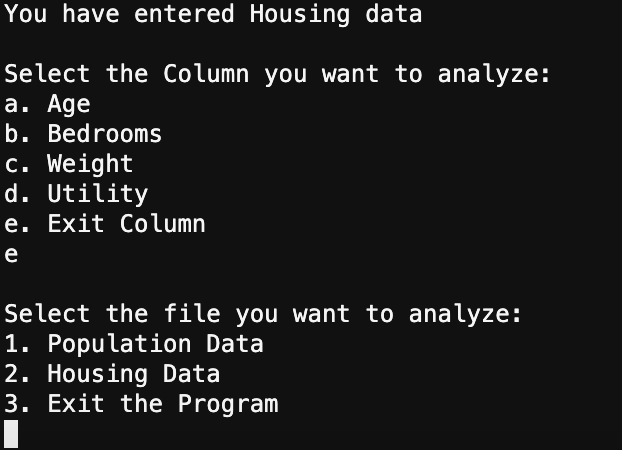

|Test Case |Input|Expected Output|Actual Output|Pass?|
|---|---|---|---|---|
|10| 3|Exiting the program|Please see below for screenshot|Yes|

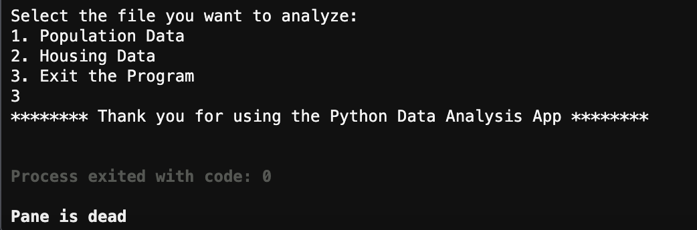
