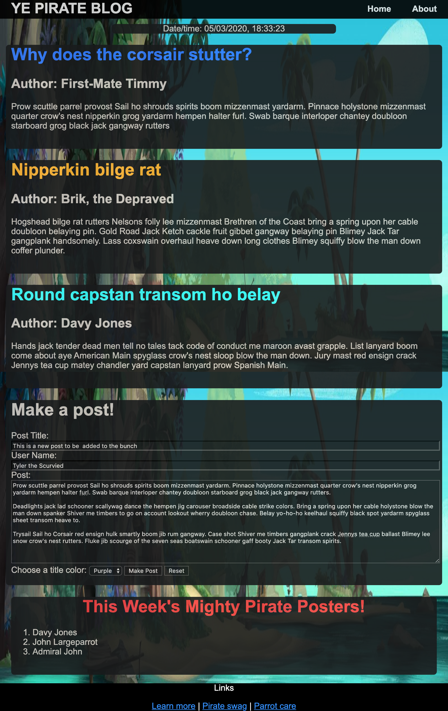

# SDEV 300 - Project 7

**Author:** Tyler D Clark  
**Date:** 3 May 2020  
This post will serve as documentation for the project 7. This markdown post provides screenshots of the webpage and screenshots of showing the deployment from the cloud9 ide.
___

## Screenshot of website running from Cloud9

## Screenshot of main page with form to be submitted

## Screenshot of main page with form submitted

## Screenshot of about page with more pictures and the tables

### Note:

The background actually has a parallax effect and the weird repeating is just an artifact of the screenshot. Also, After every post is added, an output text file is overwritten.
