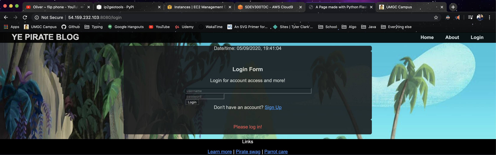
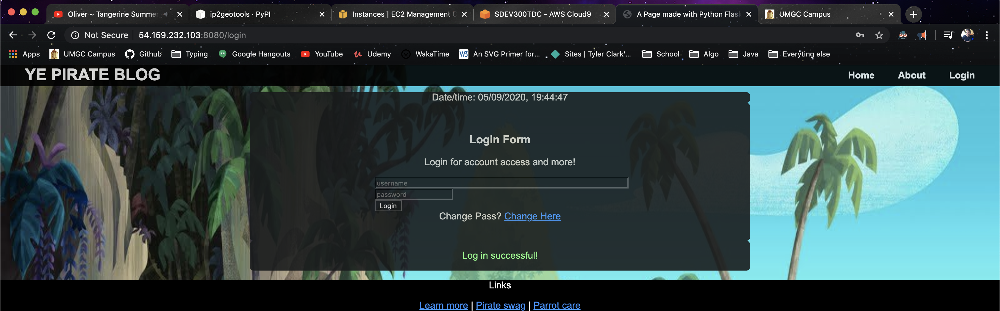
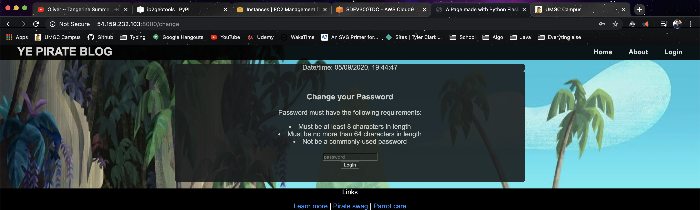
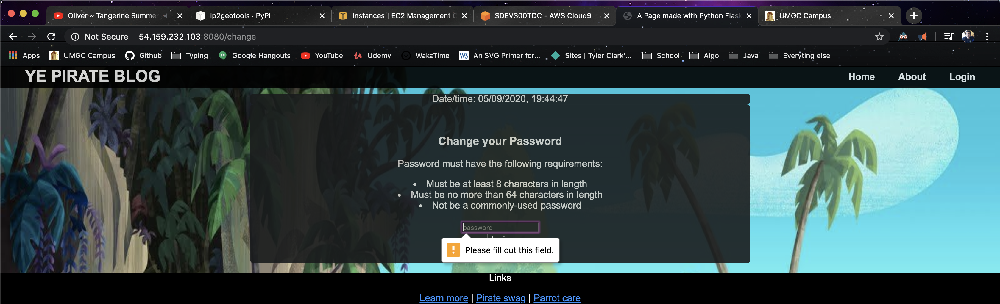
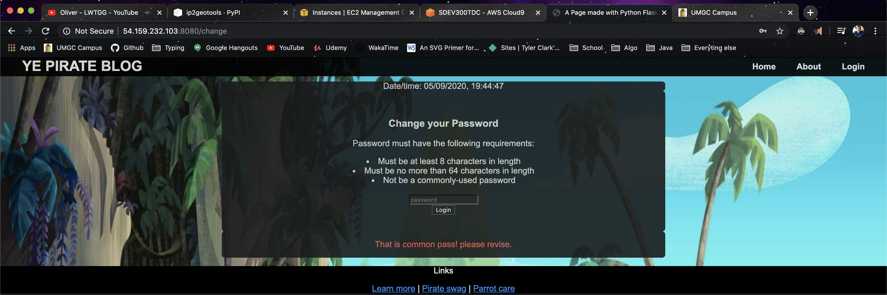
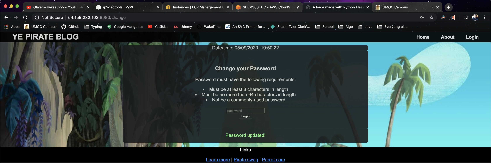
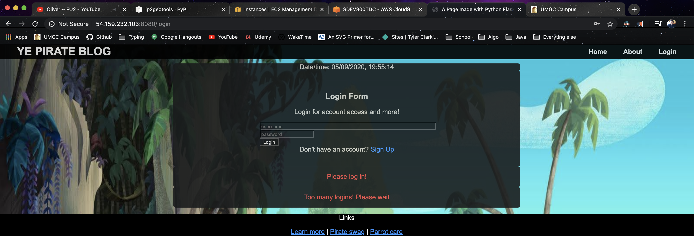

# Project 8

**Author:** Tyler D Clark  
**Date:** 3 May 2020  
This post will serve as documentation for the project 8. This markdown post provides screenshots of the webpage and
screenshots of showing the deployment from the cloud9 ide. Also includes the decrypting of the secret messages

## Web Page Authentication

### login page

### Successful Login

### Change Password form

### Correct length

### Common Password

### Successful Password Update

### Too Many Logins

## Decrypting Messages

|Encrypted message|Decrypted message|Type|
|---|---|---|
|- .... .. ... / ... -.. . ...- / ...-- ----- ----- / -.-. .-.. .- ... ... / .... .- ... / ... --- -- . / ... - .-. .- -. --. . / .-. . --.- ..- . ... - ... .-.-.-| this sdev 300 class has some strange requests.|Morse 
|U28gdGhpcyBpcyBiYXNlNjQuIE5vdyBJIGtub3cu| So this is base64. Now I know.|base64
|--- Psuwb Ysm ---- |--- Begin Key ----|Caesarian Shift|
|W oa gc qzsjsf. Bc cbs qcizr dcggwpzm twuifs hvwg cih. | I am so clever. No one could possibly figure this out. |Caesarian Shift| 
|--- Sbr Ysm ---|--- End Key ---|Caesarian Shift|
